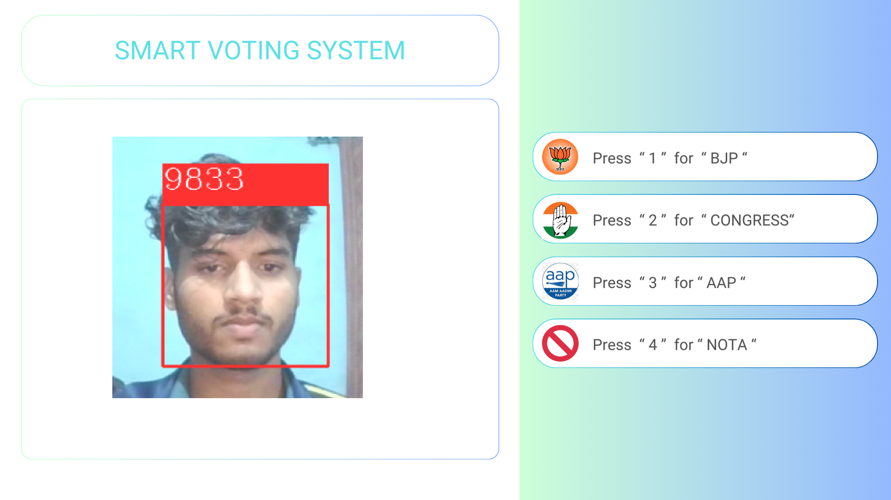

# 📤 Smart Election System 📥



A face recognition-based smart voting system that ensures secure and authenticated elections using **OpenCV** and **Machine Learning**.

## 📌 Features
- **Face Registration**: Users can register their faces using the `add_faces.py` script.
- **Face-Based Voting**: Voters are recognized using their facial data and can vote using the `give_vote.py` script.
- **Secure Voting**: Prevents multiple votes using a CSV-based tracking system.
- **Voice Feedback**: Provides real-time audio feedback to voters.
- **NVIDIA Broadcast Support**: Uses NVIDIA Broadcast Camera for better recognition.

## 🚀 Installation & Setup

### 1️⃣ Clone the Repository
```sh
git clone https://github.com/krishna25092005/smart-election-system.git
cd smart-election-system
```
### 2️⃣ Create a Virtual Environment
```sh
python -m venv venv
source venv/bin/activate  # For Linux/macOS
venv\Scripts\activate     # For Windows
```
### 3️⃣ Install Dependencies
```sh
pip install -r requirements.txt
```
### 4️⃣ Run Face Registration (add_faces.py)
```sh
python add_faces.py
```
- Enter your Aadhar number (used as an identifier).
- The camera captures and saves face data.
### 5️⃣ Run the Voting System (give_vote.py)
```sh
python give_vote.py
```
- The system recognizes the voter using the face dataset.
- If the voter is not recognized, they cannot vote.
- If the voter already voted, they are notified.
- Press:
  1. for BJP
  2. for Congress
  3. for AAP
  4. for NOTA
## 📂 Project Structure
```perl
smart-election-system/
│── data/                 # Stores face data & user names
│   ├── faces_data.pkl    # Facial embeddings
│   ├── names.pkl         # User names linked to faces
│── venv/                 # Virtual environment (optional)
│── add_faces.py          # Face registration script
│── give_vote.py          # Face-based voting system
│── background.png        # UI background image
│── Votes.csv             # Records votes securely
│── README.md             # Project documentation
```
## 📦 Dependencies
* **Python 3.8+**
* opencv-python
* numpy
* scikit-learn
* pywin32 (for Windows voice feedback)
* Install dependencies using:
```sh
pip install opencv-python numpy scikit-learn pywin32
```
## 🎥 Using NVIDIA Broadcast Camera
* **If you are using NVIDIA Broadcast, modify the script to use the correct camera index:**
```python
video = cv2.VideoCapture(1, cv2.CAP_DSHOW)  # Change 1 based on detected index
```
## 🤝 Contribution
1. Fork the repository.
2. Create a feature branch:
```sh
git checkout -b feature-name
```
3. Commit your changes:
```sh
git commit -m "Added new feature"
```
4. Push to GitHub:
```sh
git push origin feature-name
```
5. Create a Pull Request.
## 📜 License
**This project is open-source and available under the MIT License.**
<h1 align="center">💡 Made with ❤️ by <a href="https://krishna-chauhan.netlify.app">Krishna</a></h1>
